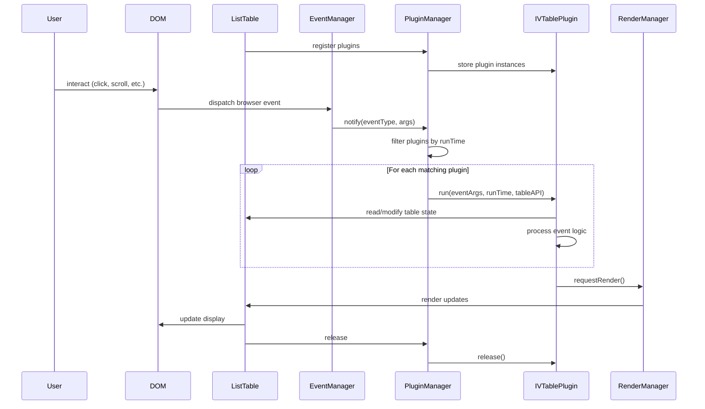

# Contributing Plugins

When businesses use VTable, they may need customized functionality, which can be implemented through plugins. Extracting common functionality into plugins avoids reinventing the wheel and makes it easier for other businesses to use these features.

Sharing plugins can improve development efficiency and reduce maintenance costs! We encourage everyone to actively contribute plugins and help improve the VTable ecosystem!

## Guidelines for Contributing Plugins

1. Plugins must follow VTable's plugin specifications.
2. Plugins must include detailed documentation, including parameter descriptions, usage examples, etc.

### Plugin Specifications
#### Interface Specifications

Plugins need to implement the `VTable.plugins.IVTablePlugin` interface.

```ts
// Plugin unified interface
export interface IVTablePlugin {
  // Plugin unique identifier
  id: string;
  // Plugin runtime trigger
  runTime: TableEvents[keyof TableEvents] | TableEvents[keyof TableEvents][];
  // Initialization method, called after VTable instance creation and before first render
  run: (...args: any[]) => void;
  // Update method, called when table data or configuration updates
  update?: (table: BaseTableAPI, options?: any) => void;
  // Destruction method, called before VTable instance is destroyed
  release?: (table: BaseTableAPI) => void;
}
```

The `runTime` parameter specifies when the plugin will run, configuring it with event types from `TableEvents`.

####  Component Lifecycle Process:

<div style="display: flex; justify-content: center;  width: 100%;">
  
</div>

Attached Mermaid sequence diagram code (for future updates, you can modify this code and update the image above):


From the above diagram, you can understand the runtime timing of plugins:
- The key role of `runTime` in plugins is to specify which VTable events they depend on.
- In the plugin's `run` method, you can access the table instance, configuration, and data; you should also handle the plugin's specific business logic in the `run` method.
- Remember to release resources in the plugin's `release` method to avoid memory leaks.

### Plugin Documentation

Plugins need to provide detailed documentation, including parameter descriptions, usage examples, etc.

Documentation generally should include the following:
- Plugin name
- Plugin description
- Plugin parameter descriptions
- Plugin usage examples
- Plugin notes and considerations
- Plugin source code link

Documentation should be placed in the `docs/assets/plugins` directory, with the filename `plugin-name.md`.


