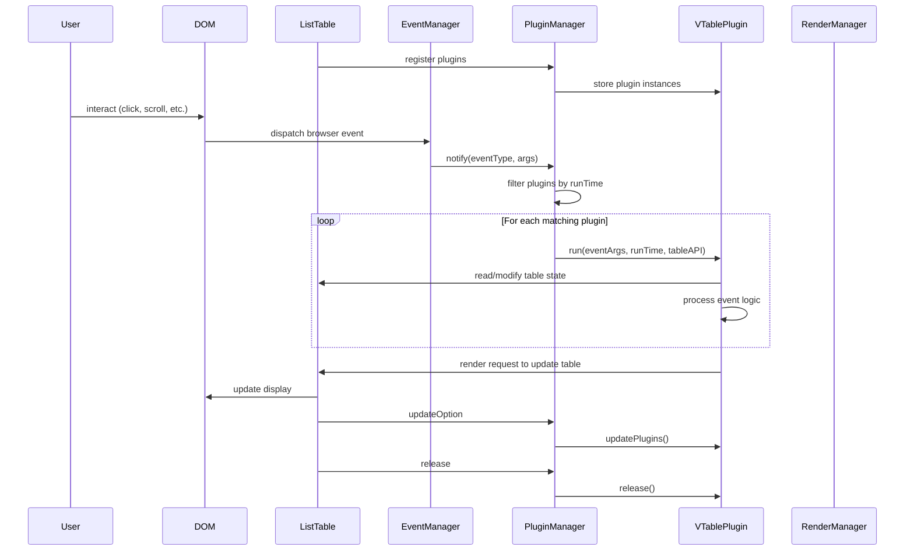

# 贡献插件

每个业务使用 VTable 时，可能需要一些定制化的功能，此时可以通过插件来实现。把通用功能抽离成插件，可以避免重复造轮子，同时也可以方便其他业务使用。

共享插件，可以提高开发效率，减少维护成本！期望大家积极贡献插件，共同完善 VTable 生态！

## 贡献插件注意事项

1. 插件需要遵循 VTable 的插件规范。
2. 插件需要有详细的文档说明，包括插件的参数说明、使用示例等。

### 插件规范
#### 接口规范

插件需要实现 `VTable.plugins.IVTablePlugin` 接口。

```ts
// 插件统一接口
export interface IVTablePlugin {
  // 插件唯一标识
  id: string;
  // 插件名称
  name: string;
  // 插件运行时机
  runTime: TableEvents[keyof TableEvents] | TableEvents[keyof TableEvents][];
  // 初始化方法，在VTable实例创建后、首次渲染前调用
  run: (...args: any[]) => void;
  // 更新方法，当表格数据或配置更新时调用
  update?: () => void;
  // 销毁方法，在VTable实例销毁前调用
  release?: (table: BaseTableAPI) => void;
}
```

其中`runTime`指定了插件的运行时机，配置是`TableEvents`中的事件类型。

####  组件的生命周期过程：

<div style="display: flex; justify-content: center;  width: 100%;">
  
</div>

附Mermaid 序列图代码（后续如果有变动可以根据如下代码做调整更新，并更新上面的图片）：


通过上图可以了解到插件的运行时机：
- `runTime`在插件中的关键作用是指定了依赖VTable的哪些事件。
- 在插件的`run`方法中，可以获取到表格的实例，以及表格的配置和数据；同时需要在`run`方法中，处理插件具体的业务逻辑。
- 请记得在插件的`release`方法中，释放插件占用的资源，避免内存泄漏。

### 插件文档说明

插件需要提供详细的文档说明，包括插件的参数说明、使用示例等。

文档一般需要包含以下内容：
- 插件的名称
- 插件的描述
- 插件的参数说明
- 插件的使用示例
- 插件的注意事项
- 插件的源码地址

文档需要放在 `docs/assets/plugins` 目录下，文件名称为 `plugin-name.md`。


